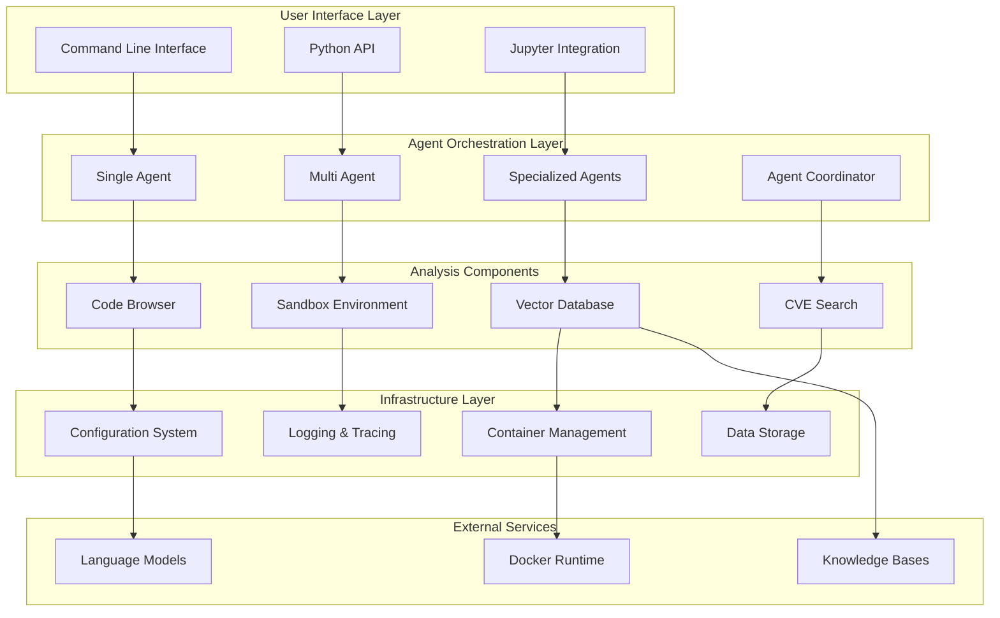
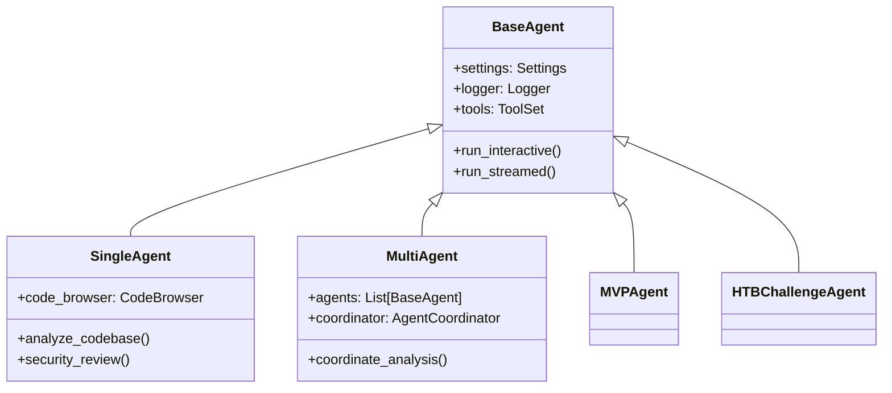
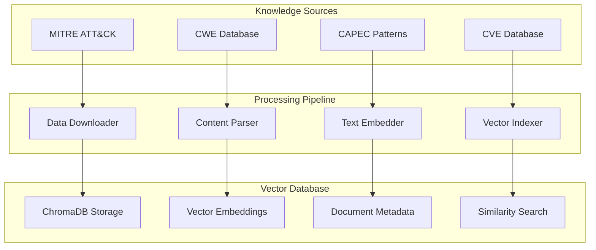

# Architecture

This section provides a comprehensive overview of IVEXES architecture, design principles, and component interactions.

## System Overview

IVEXES follows a modular, extensible architecture designed for scalability, maintainability, and security. The system is built around the concept of AI agents that coordinate to perform complex vulnerability analysis tasks.



## Design Principles

### 1. Modularity

Each component has a well-defined responsibility and interface:

- **Agents** - AI-driven analysis coordination
- **Components** - Specialized analysis capabilities
- **Services** - Supporting infrastructure
- **Interfaces** - Clean API boundaries

### 2. Extensibility

The architecture supports easy extension:

```python
# Add new agent types
class CustomAgent(BaseAgent):
    def analyze_custom_scenario(self):
        # Custom analysis logic
        pass

# Add new analysis components
class CustomAnalyzer:
    def perform_analysis(self, target):
        # Custom analysis implementation
        pass
```

### 3. Security by Design

Security considerations are built into every layer:

- **Isolation** - Sandbox environments for safe execution
- **Validation** - Input validation and sanitization
- **Permissions** - Principle of least privilege
- **Audit** - Comprehensive logging and tracing

### 4. Scalability

The system is designed to handle various scales:

- **Single files** to **large codebases**
- **Individual analysis** to **coordinated teams**
- **Local execution** to **distributed deployment**

## Core Components

### Agent System

The agent system is the heart of IVEXES, providing AI-driven analysis capabilities.

#### BaseAgent

```python
class BaseAgent:
    """Foundation for all IVEXES agents.
    
    Provides:
    - Configuration management
    - Logging and tracing
    - Common utilities
    - Error handling
    """
    
    def __init__(self, settings: PartialSettings):
        self.settings = self._merge_settings(settings)
        self.logger = self._setup_logging()
        self.tools = self._initialize_tools()
```

#### Agent Specialization



### Analysis Components

#### Code Browser

Advanced code analysis with LSP integration:

```python
class CodeBrowser:
    """LSP-based code analysis system.
    
    Features:
    - Language Server Protocol integration
    - Symbol navigation and references
    - Syntax tree analysis
    - Cross-language support
    """
    
    def __init__(self, codebase_path: str):
        self.nvim_client = self._setup_nvim_lsp()
        self.parser = TreeSitterParser()
        self.analyzer = StaticAnalyzer()
```

#### Sandbox Environment

Isolated execution for safe analysis:

```python
class SandboxEnvironment:
    """Containerized execution environment.
    
    Provides:
    - Docker-based isolation
    - Resource limits
    - Network restrictions
    - Secure file access
    """
    
    def __init__(self, image: str = "kali-ssh:latest"):
        self.container = DockerContainer(image)
        self.limits = ResourceLimits()
        self.security = SecurityPolicy()
```

### Knowledge Integration

#### Vector Database

Similarity search and knowledge retrieval:



## Configuration System

### Hierarchical Configuration

IVEXES uses a layered configuration approach:

```python
# 1. Default settings (lowest priority)
default_settings = Settings()

# 2. Environment variables
os.environ['MODEL'] = 'openai/gpt-4'

# 3. .env file
# LLM_API_KEY=your-key-here

# 4. Programmatic override (highest priority)
override_settings = PartialSettings(max_turns=20)
```

### Configuration Validation

```python
class Settings(BaseSettings):
    """Validated configuration with Pydantic.
    
    Features:
    - Type validation
    - Environment variable loading
    - Default value handling
    - Constraint checking
    """
    
    model: str = Field(default="openai/gpt-4o-mini")
    max_turns: int = Field(default=10, ge=1, le=100)
    api_key: str = Field(env="LLM_API_KEY")
```

## Security Architecture

### Threat Model

IVEXES considers these security threats:

1. **Code Injection** - Malicious code in analyzed targets
2. **Data Exfiltration** - Sensitive information leakage
3. **Resource Exhaustion** - DoS through resource consumption
4. **Privilege Escalation** - Container escape attempts

### Security Controls

#### 1. Input Validation

```python
def validate_codebase_path(path: str) -> Path:
    """Validate and sanitize codebase paths."""
    clean_path = Path(path).resolve()
    
    # Check for path traversal
    if not str(clean_path).startswith('/allowed/paths/'):
        raise SecurityError("Path traversal detected")
    
    # Verify existence and permissions
    if not clean_path.exists():
        raise ConfigurationError("Path does not exist")
    
    return clean_path
```

#### 2. Container Isolation

```python
class SecureContainer:
    """Security-hardened container configuration."""
    
    def __init__(self):
        self.security_opts = [
            '--no-new-privileges',
            '--read-only',
            '--tmpfs /tmp:noexec,nosuid,size=100m'
        ]
        self.resource_limits = {
            'memory': '2g',
            'cpus': '2.0',
            'pids_limit': 100
        }
```

#### 3. Network Security

```python
# Restricted network access
network_config = {
    'mode': 'bridge',
    'options': {
        'com.docker.network.bridge.enable_icc': 'false',
        'com.docker.network.bridge.enable_ip_masquerade': 'false'
    }
}
```

## Performance Considerations

### Scalability Patterns

#### 1. Lazy Loading

```python
class LazyCodeBrowser:
    """Lazy-loaded code analysis to improve startup time."""
    
    def __init__(self, codebase_path: str):
        self._codebase_path = codebase_path
        self._nvim_client = None  # Loaded on demand
        self._parser = None       # Loaded on demand
    
    @property
    def nvim_client(self):
        if self._nvim_client is None:
            self._nvim_client = self._setup_nvim()
        return self._nvim_client
```

#### 2. Caching Strategy

```python
class CachedVectorDB:
    """Cached vector database for improved performance."""
    
    def __init__(self):
        self._cache = LRUCache(maxsize=1000)
        self._embeddings_cache = {}
    
    def search(self, query: str, cache_key: str = None):
        if cache_key and cache_key in self._cache:
            return self._cache[cache_key]
        
        results = self._perform_search(query)
        if cache_key:
            self._cache[cache_key] = results
        return results
```

#### 3. Resource Management

```python
class ResourceManager:
    """Manage system resources efficiently."""
    
    def __init__(self):
        self.memory_monitor = MemoryMonitor()
        self.cpu_monitor = CPUMonitor()
        self.container_pool = ContainerPool(max_size=5)
    
    def allocate_resources(self, requirements):
        if not self._check_availability(requirements):
            self._cleanup_unused_resources()
        return self._allocate(requirements)
```

## Extension Points

### Custom Agents

```python
class CustomAgent(BaseAgent):
    """Example custom agent implementation."""
    
    def __init__(self, settings, custom_config):
        super().__init__(settings)
        self.custom_analyzer = CustomAnalyzer(custom_config)
    
    async def run_custom_analysis(self, target):
        # Custom analysis logic
        results = await self.custom_analyzer.analyze(target)
        return self._format_results(results)
```

### Custom Tools

```python
class CustomTool:
    """Example custom analysis tool."""
    
    def __init__(self, config):
        self.config = config
    
    def analyze(self, target):
        # Tool implementation
        return AnalysisResult(findings=[], recommendations=[])
```

### Plugin Architecture

```python
class PluginManager:
    """Manage and load plugins."""
    
    def __init__(self):
        self.plugins = {}
        self.hooks = defaultdict(list)
    
    def register_plugin(self, name: str, plugin: Plugin):
        self.plugins[name] = plugin
        for hook_name in plugin.get_hooks():
            self.hooks[hook_name].append(plugin)
    
    def execute_hooks(self, hook_name: str, *args, **kwargs):
        for plugin in self.hooks[hook_name]:
            plugin.execute_hook(hook_name, *args, **kwargs)
```

## Deployment Patterns

### Local Development

```yaml
# docker-compose.dev.yml
version: '3.8'
services:
  ivexes:
    build: .
    environment:
      - LOG_LEVEL=DEBUG
      - MODEL=openai/gpt-4o-mini
    volumes:
      - ./src:/app/src
      - ./examples:/app/examples
```

### Production Deployment

```yaml
# docker-compose.prod.yml
version: '3.8'
services:
  ivexes:
    image: ivexes:latest
    environment:
      - LOG_LEVEL=WARNING
      - MODEL=openai/gpt-4
    deploy:
      resources:
        limits:
          memory: 4G
          cpus: '2.0'
```

### Kubernetes Deployment

```yaml
apiVersion: apps/v1
kind: Deployment
metadata:
  name: ivexes
spec:
  replicas: 3
  selector:
    matchLabels:
      app: ivexes
  template:
    metadata:
      labels:
        app: ivexes
    spec:
      containers:
      - name: ivexes
        image: ivexes:latest
        resources:
          limits:
            memory: "4Gi"
            cpu: "2"
          requests:
            memory: "2Gi"
            cpu: "1"
```

---

This architecture provides a solid foundation for cybersecurity analysis while maintaining flexibility for future enhancements and integrations.