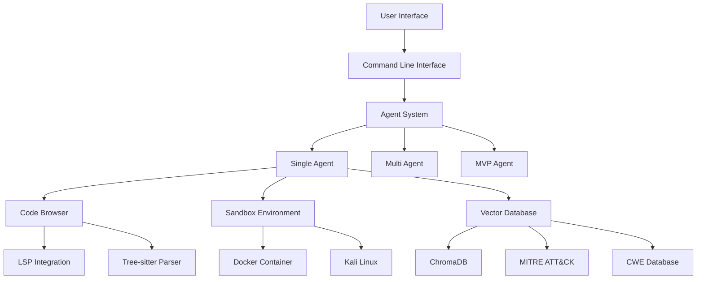

# IVEXES - Intelligent Vulnerability Exploration and Exploitation System

[](https://www.gnu.org/licenses/gpl-3.0)
[](https://www.python.org/)

**IVEXES** is a comprehensive Python framework for cybersecurity vulnerability analysis and exploitation using multi-agent AI systems. Developed as part of a bachelor thesis, it combines knowledge bases (CWE, CAPEC, MITRE ATT&CK) with dynamic analysis capabilities for automated security assessment.

!!! warning "Important Notice"
    This project is developed as part of a **bachelor thesis** for academic research purposes. It is designed to advance the understanding of automated vulnerability analysis and contribute to defensive cybersecurity research.

## Key Features

<div class="grid cards" markdown>

-   :robot:{ .lg .middle } __Multi-Agent AI System__

    ---

    Orchestrated AI agents for complex vulnerability analysis with intelligent task distribution and coordination.

    [:octicons-arrow-right-24: Learn about Agents](user-guide/agents.md)

-   :books:{ .lg .middle } __Knowledge Base Integration__

    ---

    Built-in support for CWE, CAPEC, and MITRE ATT&CK frameworks for comprehensive security analysis.

    [:octicons-arrow-right-24: Explore Vector Database](user-guide/vector-db.md)

-   :microscope:{ .lg .middle } __Advanced Code Analysis__

    ---

    LSP integration with tree-sitter parsing for deep code understanding and vulnerability detection.

    [:octicons-arrow-right-24: Code Browser Guide](user-guide/code-browser.md)

-   :package:{ .lg .middle } __Sandbox Environment__

    ---

    Docker-based isolated execution for safe analysis with Kali Linux container support.

    [:octicons-arrow-right-24: Sandbox Documentation](user-guide/sandbox.md)

</div>

## Ethical Use & Academic Purpose

**IVEXES is intended EXCLUSIVELY for:**

- :mortar_board: Academic research and education
- :shield: Defensive cybersecurity purposes  
- :test_tube: Vulnerability assessment of systems you own or have explicit permission to test
- :microscope: Security research within controlled environments
- :building_construction: Contributing to the development of better security practices

!!! danger "Strictly Prohibited"
    - Unauthorized access to systems or networks
    - Malicious exploitation of vulnerabilities
    - Any illegal cybersecurity activities
    - Attacking systems without explicit written permission
    - Commercial exploitation without proper licensing

## Quick Start

Get up and running with IVEXES in minutes:

=== "Installation"

    ```bash
    # Clone the repository
    git clone https://github.com/LetsDrinkSomeTea/ivexes.git
    cd ivexes
    
    # Install in development mode
    pip install -e .
    
    # Install with documentation tools
    pip install -e ".[docs]"
    ```

=== "Configuration"

    ```bash
    # Create environment configuration
    cat > .env << EOF
    LLM_API_KEY=your_openai_api_key_here
    MODEL=openai/gpt-4o-mini
    REASONING_MODEL=openai/o4-mini
    EOF
    ```

=== "First Run"

    ```python
    from ivexes.agents import SingleAgent
    from ivexes.config import PartialSettings
    
    # Configure for vulnerability analysis
    settings = PartialSettings(
        model='openai/gpt-4o-mini',
        codebase_path='/path/to/test/codebase'
    )
    
    agent = SingleAgent(settings=settings)
    await agent.run_interactive()
    ```

## Architecture Overview

IVEXES follows a modular architecture designed for extensibility and maintainability:



## Getting Help

- :books: **Documentation**: Comprehensive guides and API reference
- :github: **Issues**: [Report bugs or request features](https://github.com/LetsDrinkSomeTea/ivexes/issues)
- :test_tube: **Examples**: Check the `examples/` directory for usage patterns
- :mortar_board: **Academic Context**: Part of cybersecurity research thesis

## License

This project is licensed under the GPL-3.0-or-later License. See the [LICENSE](https://github.com/LetsDrinkSomeTea/ivexes/blob/main/LICENSE) file for details.

---

**Ready to get started?** Head over to the [Installation Guide](getting-started/installation.md) or explore the [User Guide](user-guide/index.md) to learn more about IVEXES capabilities.