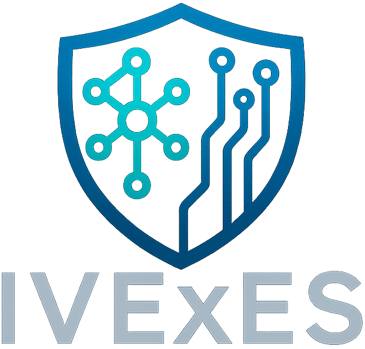
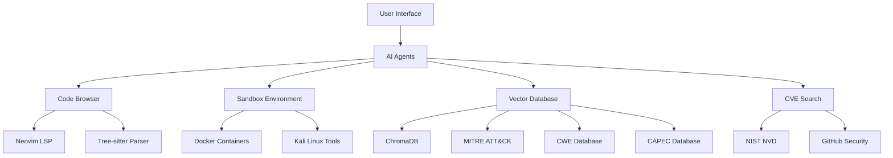

# IVExES - Intelligent Vulnerability Extraction & Exploit Synthesis



**IVExES** is an advanced Python framework for cybersecurity vulnerability analysis and exploitation using multi-agent AI systems. It combines comprehensive knowledge bases (CWE, CAPEC, MITRE ATT&CK) with dynamic analysis capabilities to provide automated, intelligent security assessment.

## Overview

IVExES transforms vulnerability analysis from a manual, time-intensive process into an automated, AI-driven workflow. By leveraging multiple specialized AI agents, the framework can analyze complex codebases, identify vulnerabilities, understand exploitation techniques, and generate comprehensive security reports.

### Key Features

!!! info "Multi-Agent Architecture"
    Specialized AI agents work collaboratively to analyze different aspects of security vulnerabilities, from code analysis to exploitation strategy development.

!!! success "Knowledge Base Integration"
    Seamlessly integrates with industry-standard security frameworks including MITRE ATT&CK, CWE (Common Weakness Enumeration), CAPEC (Common Attack Pattern Enumeration), and CVE databases.

!!! note "Dynamic Code Analysis"
    Container-based sandbox environments with Neovim LSP integration provide safe, intelligent code examination and analysis.

!!! tip "Automated Reporting"
    Generates structured vulnerability reports with detailed exploitation procedures, risk assessments, and remediation guidance.

### What Makes IVExES Unique

- **AI-First Approach**: Built from the ground up to leverage large language models for security analysis
- **Extensible Architecture**: Modular design allows easy integration of custom agents and analysis tools
- **Safe Execution**: Containerized environments ensure secure analysis of potentially malicious code
- **Comprehensive Coverage**: Analyzes vulnerabilities from multiple perspectives using specialized knowledge bases

## Quick Start

Get started with IVExES in minutes:

```bash
# Clone and setup
git clone https://github.com/LetsDrinkSomeTea/ivexes.git
cd ivexes
make setup

# Configure API key
echo "LLM_API_KEY=your_openai_api_key" > .secrets.env

# Run analysis
python -c "
from ivexes.agents import SingleAgent
agent = SingleAgent()
await agent.run_interactive()
"
```

For detailed setup instructions, see the [Quick Start Guide](quickstart.md).

## Core Components

### 🤖 AI Agents

IVExES provides multiple specialized agents for different analysis scenarios:

- **[SingleAgent](api/agents.md#singleagent)**: Individual vulnerability assessment with focused analysis
- **[MultiAgent](api/agents.md#multiagent)**: Orchestrated multi-agent analysis for complex vulnerabilities
- **[HTBChallengeAgent](api/agents.md#htbchallengeagent)**: Specialized for Hack The Box challenge analysis
- **[MVPAgent](api/agents.md#mvpagent)**: Minimal viable product for quick vulnerability checks

### 🔍 Code Analysis

Advanced code analysis capabilities through multiple integrated systems:

- **[Code Browser](api/code_browser.md)**: Neovim LSP integration for intelligent code navigation
- **[Sandbox System](api/sandbox.md)**: Docker-based execution environments for safe analysis
- **Tree-sitter Parsing**: Deep code structure understanding and analysis

### 📊 Knowledge Integration

Comprehensive cybersecurity knowledge base integration:

- **[Vector Database](api/vector_db.md)**: ChromaDB-powered semantic search across security frameworks
- **[CVE Search](api/cve_search.md)**: Real-time vulnerability database integration
- **MITRE ATT&CK**: Threat intelligence and attack pattern correlation
- **CWE/CAPEC**: Weakness and attack pattern classification

### ⚙️ Configuration & Tools

Flexible configuration and utility systems:

- **[Settings Management](api/config.md)**: Environment-based configuration with validation
- **[Shared Tools](api/tools.md)**: Utilities for token management, container operations, and formatting
- **Logging & Monitoring**: Comprehensive observability and debugging capabilities

## Use Cases

### 🏢 Enterprise Security Assessment

- **Large Codebase Analysis**: Multi-agent orchestration for comprehensive security reviews
- **Vulnerability Prioritization**: AI-driven risk assessment and remediation planning
- **Compliance Reporting**: Automated generation of security compliance documentation

### 🎓 Educational Security Research

- **CTF Challenge Analysis**: Specialized agents for capture-the-flag competitions
- **Vulnerability Research**: Deep analysis of security weaknesses and exploitation techniques
- **Security Training**: Interactive learning through guided vulnerability analysis

### 🔬 Research & Development

- **Novel Vulnerability Discovery**: AI-assisted identification of previously unknown weaknesses
- **Exploitation Technique Development**: Automated generation of proof-of-concept exploits
- **Security Tool Development**: Framework for building custom security analysis tools

## Architecture Overview



## Getting Started

### 1. Installation
Follow the [installation guide](documentation/installation.md) to set up IVExES with all dependencies.

### 2. Configuration
Configure IVExES for your environment using the [configuration guide](documentation/configuration.md).

### 3. Basic Usage
Learn fundamental workflows with the [usage guide](documentation/usage.md).

### 4. Examples
Explore practical examples in our [examples collection](documentation/examples.md).

### 5. Development
Extend IVExES with custom agents using the [development guide](documentation/development.md).

## Community & Support

- **Documentation**: Comprehensive guides and API references
- **Examples**: Real-world usage examples and tutorials
- **GitHub**: Source code, issues, and contributions
- **Research**: Academic papers and research publications

## License & Ethics

IVExES is licensed under the GNU General Public License v3.0. This framework is designed for:

- ✅ **Educational purposes** and security research
- ✅ **Authorized penetration testing** and security assessments
- ✅ **Defensive security** tool development
- ❌ **Unauthorized access** or malicious activities

Users are responsible for ensuring compliance with applicable laws and regulations.

---

**Ready to get started?** Jump to the [Quick Start Guide](quickstart.md) or explore our comprehensive [documentation](documentation/architecture.md).